# Nusatech Development DevOps Stack
### Professional Infrastructure Automation Platform

---

## 📋 Executive Summary

Nusatech DevOps Stack adalah platform infrastruktur yang dirancang khusus untuk mendukung pengembangan perangkat lunak yang etis dan profesional. Platform ini mengintegrasikan teknologi terkini dengan praktik keamanan terbaik, memberikan solusi lengkap untuk CI/CD, kolaborasi tim, dan manajemen infrastruktur.

### Key Value Propositions

- **🚀 Deployment Otomatis** - Infrastructure as Code menggunakan Ansible
- **🔒 Keamanan Enterprise** - Multi-layer security dengan enkripsi end-to-end
- **⚡ High Performance** - Optimized untuk performa maksimal dengan resource terbatas
- **🌐 SSL/TLS Otomatis** - Certificate management dengan Let's Encrypt
- **📊 Monitoring Terintegrasi** - Real-time monitoring dan logging
- **🛡️ Template-based Security** - No hardcoded credentials, template-based configuration

---

## 🚀 Quick Start Guide

### Prerequisites
- **Server**: Ubuntu 20.04+ with 6GB RAM, 50GB storage
- **Control Machine**: Ansible 2.9+, Python 3.8+, SSH key-based authentication
- **Domain**: Valid domain with DNS management access

### 1. Initial Setup
```bash
# Clone repository
git clone https://github.com/nusatech/devops-stack.git
cd nusatech-devops-stack

# Create configuration files from templates
cp inventory/hosts.yml.example inventory/hosts.yml
cp group_vars/vault.yml.example group_vars/vault.yml
```

### 2. Generate Secure Passwords
```bash
# Generate secure passwords automatically
openssl rand -base64 32 | tr -d "=+/" | cut -c1-25

# Or create a simple script
for i in {1..5}; do
  echo "Password $i: $(openssl rand -base64 32 | tr -d '=+/' | cut -c1-25)"
done
```

### 3. Configure Your Environment
```bash
# Edit inventory with your server details
nano inventory/hosts.yml
# Replace:
# - YOUR_SERVER_IP with your actual server IP
# - YOUR_SSH_USER with your SSH username (e.g., admin, ubuntu)
# - YOUR_SSH_KEY with your SSH key path

# Edit vault with your domain and generated passwords
nano group_vars/vault.yml
# Replace:
# - your-domain.com with your actual domain
# - admin@your-domain.com with your email
# - All GENERATE_SECURE_PASSWORD_HERE with strong passwords
```

### 4. DNS Configuration
Ensure these subdomains point to your server IP:
```bash
traefik.yourdomain.com  → YOUR_SERVER_IP
cicd.yourdomain.com     → YOUR_SERVER_IP  
chat.yourdomain.com     → YOUR_SERVER_IP
```

### 5. Encrypt Sensitive Data
```bash
# Encrypt vault file with Ansible Vault
ansible-vault encrypt group_vars/vault.yml

# Save vault password securely (optional)
echo "your-vault-password" > .vault_password
chmod 600 .vault_password
```

### 6. Deploy
```bash
# Install Ansible dependencies
make install

# Test connectivity
make ping

# Deploy full stack
make deploy
```

### 7. Access Your Services
After successful deployment:
- **Traefik Dashboard**: https://traefik.yourdomain.com (admin/[your-password])
- **Jenkins**: https://cicd.yourdomain.com 
- **Mattermost**: https://chat.yourdomain.com

---

## 🏗️ Arsitektur Sistem

### Network Architecture Diagram

```mermaid
graph TB
    Internet[🌐 Internet] --> LB[Load Balancer<br/>Traefik Proxy<br/>:80, :443]
    
    LB --> SSL{SSL Termination<br/>Let's Encrypt}
    
    SSL --> |traefik.domain.com| Dashboard[📊 Traefik Dashboard]
    SSL --> |cicd.domain.com| Jenkins[⚡ Jenkins CI/CD<br/>:8080]
    SSL --> |chat.domain.com| Mattermost[💬 Mattermost<br/>:8065]
    
    subgraph "Docker Network: nusatech_devops_network"
        Jenkins --> |Database Connection| PostgreSQL[(🗄️ PostgreSQL<br/>Database)]
        Mattermost --> PostgreSQL
        
        Jenkins --> Docker[🐳 Docker Socket<br/>/var/run/docker.sock]
    end
    
    subgraph "Security Layer"
        UFW[🔥 UFW Firewall<br/>Ports: 22, 80, 443]
        Fail2ban[🛡️ Fail2ban<br/>SSH Protection]
        AutoUpdate[🔄 Auto Updates<br/>Security Patches]
        Vault[🔒 Ansible Vault<br/>AES256 Encryption]
    end
    
    style LB fill:#e1f5fe
    style SSL fill:#f3e5f5
    style Jenkins fill:#fff3e0
    style Mattermost fill:#e8f5e8
    style PostgreSQL fill:#fce4ec
    style Vault fill:#ffebee
```



### Service Architecture

```mermaid
graph LR
    subgraph "Infrastructure Layer"
        Ubuntu[🖥️ Ubuntu Server<br/>6GB RAM, 50GB Storage]
        Docker[🐳 Docker Engine<br/>Container Runtime]
        Network[🔗 Docker Network<br/>nusatech_devops_network]
    end
    
    subgraph "Proxy Layer"
        Traefik[🌐 Traefik v3.4<br/>Reverse Proxy]
        LetsEncrypt[🔐 Let's Encrypt<br/>SSL Certificates]
    end
    
    subgraph "Application Layer"
        Jenkins[⚡ Jenkins 2.504<br/>CI/CD Platform]
        Mattermost[💬 Mattermost 10.9<br/>Team Chat]
        PostgreSQL[🗄️ PostgreSQL 17<br/>Database]
    end
    
    subgraph "Security Layer"
        UFW[🔥 UFW Firewall]
        Fail2ban[🛡️ Fail2ban IPS]
        Vault[🔒 Ansible Vault<br/>Secret Management]
        Templates[📋 Template-based Config<br/>No Hardcoded Secrets]
    end
    
    Ubuntu --> Docker
    Docker --> Network
    Network --> Traefik
    Network --> Jenkins
    Network --> Mattermost
    Network --> PostgreSQL
    Traefik --> LetsEncrypt
```



---

## 🛠️ Technology Stack

### Core Technologies

| Component | Technology | Version | Purpose |
|-----------|------------|---------|---------|
| **Container Runtime** | Docker Engine | Latest | Application containerization |
| **Orchestration** | Docker Compose | V2 | Service orchestration |
| **Reverse Proxy** | Traefik | v3.4.4 | Load balancing & SSL termination |
| **CI/CD Platform** | Jenkins | 2.504.3-LTS | Continuous integration & deployment |
| **Team Communication** | Mattermost | 10.9.1 | Team collaboration platform |
| **Database** | PostgreSQL | 17.5-Alpine | Relational database |
| **Automation** | Ansible | 2.9+ | Infrastructure as Code |

### Security Technologies

| Component | Technology | Purpose |
|-----------|------------|---------|
| **Firewall** | UFW (Uncomplicated Firewall) | Network security |
| **Intrusion Prevention** | Fail2ban | SSH brute force protection |
| **SSL/TLS** | Let's Encrypt | Automatic certificate management |
| **Secret Management** | Ansible Vault | Encrypted configuration |
| **Auto Updates** | Unattended Upgrades | Security patch management |
| **Template Security** | Template-based Config | No hardcoded secrets |

---

## 🔒 Security Implementation

### Multi-Layer Security Architecture

```mermaid
graph TD
    Internet[🌐 Internet Traffic] --> Firewall[🔥 UFW Firewall<br/>Ports: 22, 80, 443]
    
    Firewall --> IPS[🛡️ Fail2ban IPS<br/>SSH Protection]
    
    IPS --> SSL[🔐 SSL Termination<br/>Let's Encrypt TLS 1.3]
    
    SSL --> Headers[📋 Security Headers<br/>HSTS, XSS Protection]
    
    Headers --> Auth[🔑 Authentication<br/>Basic Auth Dashboard]
    
    Auth --> Container[🐳 Container Security<br/>Non-root Users]
    
    Container --> Network[🔗 Isolated Networks<br/>Docker Bridge]
    
    Network --> Secrets[🗝️ Secret Management<br/>Ansible Vault AES256]
    
    Secrets --> Templates[📋 Template Security<br/>No Hardcoded Data]
```



### Security Features

#### Template-Based Security ⭐ **NEW**
- **No Hardcoded Credentials**: All sensitive data stored in templates
- **Dynamic Configuration**: Domain and passwords from vault variables only
- **Safe Repository**: Public repository with no sensitive information
- **Template Files**: `.example` files for easy setup

#### Network Security
- **Minimal Attack Surface**: Only ports 22, 80, 443 open
- **Fail2ban Protection**: Automatic blocking for SSH brute force attacks
- **Container Isolation**: Isolated Docker networks for service communication

#### SSL/TLS Security
- **Automatic Certificate Management**: Let's Encrypt integration with auto-renewal
- **TLS 1.3 Support**: Latest protocol for optimal performance and security
- **HSTS Headers**: Strict Transport Security for modern browsers
- **Security Headers**: XSS protection, content type sniffing prevention

#### Access Control
- **SSH Key Authentication**: Password authentication disabled
- **Ansible Vault**: AES256 encryption for all secrets
- **Basic Authentication**: Protected Traefik dashboard
- **Role-based Access**: Granular permission control

#### Container Security
- **Non-privileged Containers**: Running containers with non-root users
- **Read-only Filesystems**: Critical mounts in read-only mode
- **Security Contexts**: No new privileges flag for container security
- **Resource Limits**: Memory and CPU limits to prevent resource exhaustion

---

## 🎛️ Operations & Management

### Daily Operations

#### Service Management
```bash
# Check all services status
make status

# Restart all services
make restart-services

# View service logs
make logs-traefik    # Traefik logs
make logs-jenkins    # Jenkins logs  
make logs-mattermost # Mattermost logs
```

#### Health Monitoring
```bash
# Security audit
make security-audit

# System connectivity test
make ping

# Check syntax before deployment
make check
```

### Maintenance Tasks

#### System Updates
```bash
# Update system packages
make update-system

# Clean temporary files
make clean

# Lint Ansible playbooks
make lint
```

#### Secret Management
```bash
# Edit encrypted secrets
make edit-vault

# Encrypt vault file
make encrypt

# Decrypt vault file (for backup)
make decrypt
```

### Deployment Options

#### Modular Deployment
```bash
# Deploy individual components
make deploy-container  # Docker installation only
make deploy-security   # Security configuration only
make deploy-proxy      # Traefik reverse proxy only
make deploy-cicd      # Jenkins & Mattermost only
```

#### Debug Mode
```bash
# Debug deployment with verbose output
make debug-full      # Full stack debug
make debug-container # Container debug
make debug-proxy     # Traefik debug
make debug-cicd      # CI/CD debug
```

---

## 📊 Post-Deployment Configuration

### Jenkins Initial Setup

#### 1. Access Jenkins Dashboard
```
URL: https://cicd.yourdomain.com
```

#### 2. Retrieve Initial Admin Password
```bash
# Get initial password from deployment output or run:
make logs-jenkins | grep -A 10 -B 10 "Administrator password"
```

#### 3. Essential Plugin Installation
```yaml
Recommended Plugins:
  - Docker Pipeline
  - GitLab Integration  
  - Blue Ocean UI
  - Build Timeout
  - Timestamper
  - Workspace Cleanup
  - Pipeline Stage View
  - Credentials Binding
```

### Mattermost Team Setup

#### 1. Access Mattermost
```
URL: https://chat.yourdomain.com
```

#### 2. System Admin Configuration
- Create system administrator account
- Configure team settings
- Set up user permissions
- Enable integrations

### Traefik Dashboard

#### 1. Access Dashboard
```
URL: https://traefik.yourdomain.com
Credentials: admin / [your-configured-password]
```

#### 2. Monitor Services
- Real-time service status
- SSL certificate status
- Request metrics
- Error monitoring

---

## 🚨 Troubleshooting Guide

### Common Issues & Solutions

#### SSH Connection Issues
```bash
# Problem: Permission denied (publickey)
# Solution: Check SSH key permissions
chmod 600 ~/.ssh/your-ssh-key
ssh-add ~/.ssh/your-ssh-key

# Test SSH connection
ssh -vvv -i ~/.ssh/your-ssh-key user@YOUR_SERVER_IP
```

#### Docker Service Issues
```bash
# Problem: Docker containers not starting
# Check Docker daemon status
ansible all -i inventory/hosts.yml -m shell -a "systemctl status docker"

# Check container logs
make logs-<service-name>

# Restart Docker service
ansible all -i inventory/hosts.yml -m shell -a "systemctl restart docker" --become
```

#### SSL Certificate Issues
```bash
# Problem: Let's Encrypt certificate generation failed
# Check Traefik logs
make logs-traefik

# Verify DNS propagation
dig +short traefik.yourdomain.com
dig +short cicd.yourdomain.com
dig +short chat.yourdomain.com

# Manual certificate regeneration
ansible all -i inventory/hosts.yml -m shell -a "docker exec traefik rm -f /etc/traefik/acme.json"
make restart-services
```

#### Template Configuration Issues
```bash
# Problem: Placeholder values not replaced
# Check for unreplaced templates
grep -r "YOUR_SERVER_IP\|GENERATE_SECURE" inventory/ group_vars/

# Problem: Vault not encrypted
# Encrypt vault file
make encrypt

# Check vault status
file group_vars/vault.yml  # Should show "data" if encrypted
```

---

## 📁 Project Structure

```
nusatech-devops-stack/
├── 📄 README.md                    # Project documentation (this file)
├── ⚙️ ansible.cfg                  # Ansible configuration
├── 🔨 Makefile                     # Automation commands
├── 📋 requirements.yml             # Ansible collections
├── 🎭 site.yml                     # Main deployment playbook
├── 🚫 .gitignore                   # Git ignore rules (security-focused)
│
├── 📂 inventory/
│   ├── 🏠 hosts.yml.example       # Server inventory template (SAFE)
│   └── 🏠 hosts.yml               # Actual server config (GITIGNORED)
│
├── 📂 group_vars/
│   ├── 🌍 all.yml                 # Global variables (dynamic, safe)
│   ├── 🔐 vault.yml.example       # Vault template (SAFE)
│   └── 🔐 vault.yml               # Encrypted secrets (GITIGNORED)
│
├── 📂 playbooks/                   # Ansible playbooks
│   ├── 🐳 container.yml           # Docker installation & configuration
│   ├── 🔒 security.yml            # Security hardening (UFW, Fail2ban)
│   ├── 🌐 proxy.yml               # Traefik reverse proxy deployment
│   └── ⚡ cicd.yml                # Jenkins & Mattermost deployment
│
└── 📂 roles/                       # Ansible roles
    ├── 📂 container/               # Docker role
    ├── 📂 security/                # Security role
    ├── 📂 proxy/                   # Traefik role
    └── 📂 cicd/                    # CI/CD role
```

### File Safety Status

| File Type | Status | Description |
|-----------|--------|-------------|
| `*.example` | ✅ **SAFE** | Template files, no sensitive data |
| `group_vars/all.yml` | ✅ **SAFE** | Dynamic variables only |
| `group_vars/vault.yml` | ❌ **SENSITIVE** | Contains secrets, gitignored |
| `inventory/hosts.yml` | ❌ **SENSITIVE** | Contains server IPs, gitignored |

---

## 🔄 DevOps Best Practices

### Infrastructure as Code (IaC)

#### Version Control
- All configurations stored in Git repository
- Template-based approach for sensitive data
- Branching strategy for development and production
- Pull request review for infrastructure changes
- Tag versioning for release management

#### Configuration Management
- Ansible for automation and consistency
- Idempotent playbooks for reliable deployments
- Variable separation for different environments
- Secret management with Ansible Vault
- Template-based security for safe public repositories

### Security-First Development

#### Template-Based Security
```bash
# Before (UNSAFE - hardcoded data)
vault_domain: "mycompany.com"
ansible_host: 192.168.1.100

# After (SAFE - templated data)
vault_domain: "{{ vault_domain | default('example.com') }}"
ansible_host: YOUR_SERVER_IP  # In template file
```

#### Safe Repository Practices
- No sensitive data in repository
- Template files for all configurations
- Automated security checks in CI/CD
- Pre-commit hooks for validation
- Documentation for secure setup

---

## 🔒 Security Notes

### 🚨 Important Security Reminders

- **Never commit `group_vars/vault.yml` unencrypted**
- **Never commit `inventory/hosts.yml` with real IPs**
- **Always use strong, unique passwords**
- **Keep vault password secure and backed up**
- **Regularly update dependencies and base images**
- **Monitor access logs and security alerts**

### 🛡️ Security Checklist

Before deployment:
- [ ] All template files configured with real values
- [ ] Vault file encrypted (`make encrypt`)
- [ ] No placeholder passwords in configurations
- [ ] SSH keys properly configured with correct permissions
- [ ] DNS records pointing to correct server IP
- [ ] Strong passwords generated for all services
- [ ] Vault password backed up securely

### 🔍 Security Validation

```bash
# Check vault encryption status
file group_vars/vault.yml  # Should show "data" if encrypted

# Verify no sensitive data in templates
grep -r "GENERATE_SECURE\|YOUR_SERVER" . --exclude-dir=.git

# Check SSH key permissions
ls -la ~/.ssh/  # Keys should be 600 or 400

# Test SSH connection
ssh -o ConnectTimeout=10 user@server "echo 'Connection successful'"
```

---

## 🤝 Contributing & Development

### Development Workflow

#### 1. Local Development Setup
```bash
# Fork repository
git fork nusatech-devops-stack

# Clone forked repository
git clone https://github.com/your-username/nusatech-devops-stack.git

# Create development branch
git checkout -b feature/your-feature-name

# Setup development environment
cp inventory/hosts.yml.example inventory/hosts.yml
cp group_vars/vault.yml.example group_vars/vault.yml
```

#### 2. Security Guidelines for Contributors
- **Never commit real configurations**: Always use template files
- **Test with dummy data**: Use placeholder values for testing
- **Validate security**: Run security checks before committing
- **Document changes**: Update documentation for new features
- **Follow conventions**: Use established naming and structure

#### 3. Code Standards
- Follow Ansible best practices and naming conventions
- Use meaningful variable names and task descriptions
- Implement proper error handling and rollback mechanisms
- Document complex configurations with inline comments
- Maintain idempotency for all automation tasks
- Use template-based configuration for sensitive data

### Quality Assurance

#### Pre-commit Checklist
- [ ] No sensitive data in commits
- [ ] Template files updated if needed
- [ ] Syntax validation with `make check`
- [ ] Linting with `make lint`
- [ ] Security validation passed
- [ ] Documentation updated for changes
- [ ] Testing on clean environment

---

## 📞 Support & Documentation

### Getting Help

#### Community Support
- **Issues**: Submit via GitHub Issues with detailed problem description
- **Discussions**: Join community discussions for general questions
- **Wiki**: Check project wiki for additional documentation
- **Pull Requests**: Contribute improvements with proper testing

#### Documentation Resources
- **Ansible Documentation**: https://docs.ansible.com/
- **Docker Documentation**: https://docs.docker.com/
- **Traefik Documentation**: https://doc.traefik.io/traefik/
- **Jenkins Documentation**: https://www.jenkins.io/doc/
- **Mattermost Documentation**: https://docs.mattermost.com/

### FAQ

#### Q: How do I reset my vault password?
```bash
# If you have access to encrypted vault
ansible-vault rekey group_vars/vault.yml

# If you lost vault password, recreate from template
cp group_vars/vault.yml.example group_vars/vault.yml
# Edit with your values, then encrypt
ansible-vault encrypt group_vars/vault.yml
```

#### Q: Can I use this in production?
Yes, but ensure you:
- Use strong, unique passwords for all services
- Regularly update dependencies and base images
- Implement proper backup strategies
- Monitor security logs and alerts
- Follow your organization's security policies

#### Q: How do I add new services?
1. Create new role in `roles/` directory
2. Add service configuration to `group_vars/all.yml`
3. Create Docker Compose template
4. Add Traefik labels for routing
5. Update playbooks and documentation

---

## 📋 Quick Reference

### Essential Commands

```bash
# Initial setup
cp inventory/hosts.yml.example inventory/hosts.yml
cp group_vars/vault.yml.example group_vars/vault.yml
make encrypt
make ping
make deploy

# Daily operations
make status                 # Check service status
make logs-traefik          # View Traefik logs
make logs-jenkins          # View Jenkins logs
make logs-mattermost       # View Mattermost logs
make restart-services      # Restart all services

# Maintenance
make update-system         # Update system packages
make security-audit        # Run security audit
make clean                # Clean temporary files

# Vault management
make edit-vault           # Edit encrypted vault
make encrypt              # Encrypt vault file
make decrypt              # Decrypt vault file (backup only)
```

### Service URLs (replace yourdomain.com)

- **Traefik Dashboard**: https://traefik.yourdomain.com
- **Jenkins CI/CD**: https://cicd.yourdomain.com
- **Mattermost Chat**: https://chat.yourdomain.com

### Default Ports

| Service | Internal Port | External Access |
|---------|---------------|-----------------|
| SSH | 22 | Direct |
| HTTP | 80 | Redirects to HTTPS |
| HTTPS | 443 | Via Traefik |
| Jenkins | 8080 | Via Traefik only |
| Mattermost | 8065 | Via Traefik only |
| PostgreSQL | 5432 | Internal only |

---

**© 2024 Nusatech Development - Built with ❤️ for Ethical Software Development**

*This documentation is designed to support ethical, secure, and sustainable software development. All implementations follow industry best practices and international security standards.*
